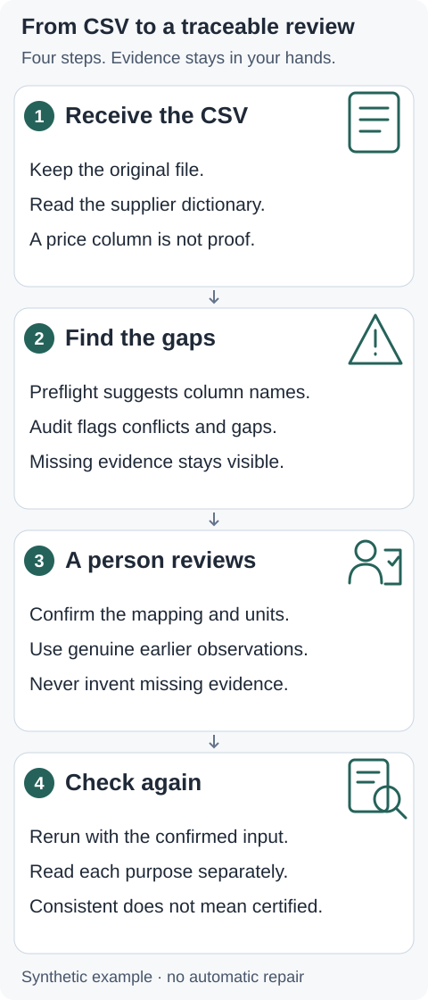

# ETF50 input auditor

[English](README.md) · [简体中文](README.zh-CN.md) · [Try the example](docs/REPORT_WALKTHROUGH.md)

**Check your 510050 option CSV before you model it.**

- Find input conflicts and missing evidence, with record-level explanations.
- Review supplier column suggestions, then explicitly confirm a mapping.
- Run locally with Python: no AI account or runtime network. Consistency is not certification.

## A four-step review



1. **Receive:** keep the original CSV and read its dictionary.
2. **Inspect:** preflight suggests headers; the audit flags conflicts and missing evidence.
3. **Human review:** confirm mapping, units and genuinely available observations. Do not invent facts.
4. **Recheck:** inspect historical-IV and pairing states separately. Unknown evidence stays unknown.

## Start with a working example

Python 3.9+, macOS/Linux. From this repository root (publicly runnable):

```sh
python3 -m venv .venv
.venv/bin/python -m pip install .
.venv/bin/etf50-audit --version
.venv/bin/python scripts/reproduce_onboarding_case.py --output onboarding-demo
```

Version: **0.4.0rc6**. Open `onboarding-demo/comparison.md` to see three problems, the explicit human corrections and both reports. Use a fresh output directory. The demonstration swaps predetermined synthetic fixtures and exits0 when expected before/after behavior is reproduced. Real corrections must be supplied and confirmed by a person.

[See the actual JSON and offline report](docs/REPORT_WALKTHROUGH.md) · [Full normal/failure/import walkthrough](docs/GETTING_STARTED.md)

## Bring your own supplier CSV

| Start here | What you need |
|---|---|
| Basic inspection | UTF-8 CSV, one contract per Shanghai date; ten base columns. Excel: export CSV first. |
| Historical-IV inputs | Independent ETF observation, r/q conventions and known times, effective terms and source evidence. |
| Call-put pairing | Same-term C/P, business timestamps, bid/ask and quantities. |

[Supplier checklist](docs/SUPPLIER_REQUIREMENTS.md) · [Exact schema](docs/ADMISSION_SCHEMA.md) · [Import guide](docs/IMPORT_GUIDE.md)

Preflight suggestions do not infer prices, units or timezones. Conversion needs a confirmed one-to-one mapping and current source hash, and does not change values. Keep originals and reports private; previews contain IDs and prices. Store them in ignored `user-data/` and `audit-output/` and inspect before sharing.

## Read the result

| State | Meaning |
|---|---|
| `blocked` | An implemented hard contradiction or unsupported input. |
| `needs_evidence` | Missing or unusable evidence; some cases require correcting values too. |
| `conditional_input_consistent` | Declared inputs agree under implemented checks; facts remain unverified. |

Main audit exits0/1/2 for consistent / findings / invalid input. **Preflight exit0 only means its inspection succeeded without mapping/type warnings; it is not admission.** See the [full walkthrough](docs/GETTING_STARTED.md) for commands and purpose-specific interpretation.

## Scope and evidence

Static M/10000 contracts only; adjusted, cross-event and unverified event-day terms are rejected. This tool does not authenticate sources or permissions, certify the daily universe, calculate IV/carry, trade or provide financial advice. The historical empirical study remains incomplete. The simulated evaluation did not establish higher accuracy or human time savings.

[Boundaries](docs/TOOL_BOUNDARIES.md) · [Simulated evaluation](docs/SIMULATED_USER_EVALUATION.md) · [Validation](docs/PREFLIGHT_VALIDATION.md) · [Related work](docs/RELATED_WORK.md) · [Numerical auxiliary](docs/NUMERICAL_AUXILIARY.md) · [Release status](docs/RELEASE_CHECKLIST.md)

## License

[MIT](LICENSE) · Copyright (c) 2026 JasonChen. Applies to this software, not supplier data or third-party materials. Version0.4.0rc6 is published. No remote CI is configured.
