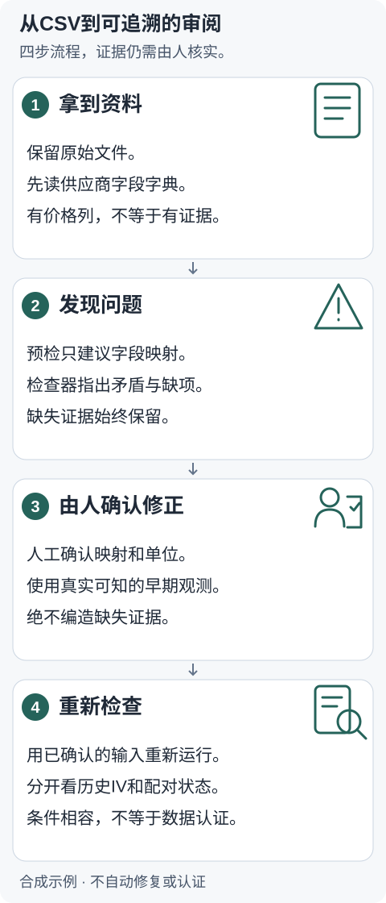

# 50ETF研究输入检查小工具

[English](README.md) · [简体中文](README.zh-CN.md) · [看示例](docs/REPORT_WALKTHROUGH.zh-CN.md)

**建模之前，先检查你的510050期权CSV。**

- 发现输入矛盾和证据缺项，给出逐条解释。
- 审阅供应商字段建议，再明确确认映射。
- 本地Python运行：不需要AI账号或运行时网络。条件相容不等于认证。

## 四步看懂流程



1. **拿到资料：**保留原始CSV，阅读字段字典。
2. **发现问题：**预检建议列名，检查器指出矛盾和缺失证据。
3. **人工确认：**核实映射、单位和当时真实可知的观测，不编造事实。
4. **重新检查：**分开查看历史IV和配对状态，未知证据继续保留。

## 先跑一个完整示例

Python3.9+，macOS/Linux。在仓库根目录运行（公开可运行）：

```sh
python3 -m venv .venv
.venv/bin/python -m pip install .
.venv/bin/etf50-audit --version
.venv/bin/python scripts/reproduce_onboarding_case.py --output onboarding-demo
```

版本：**0.4.0rc6**。打开`onboarding-demo/comparison.md`，查看三个问题、明确的人工修正和前后报告。输出目录必须新建。演示替换预先定义的合成资料；复现预期前后行为时退出0。真实资料的修正须由人提供并确认。

[查看实际JSON与离线报告](docs/REPORT_WALKTHROUGH.zh-CN.md) · [完整正常/故障/导入演示](docs/GETTING_STARTED.zh-CN.md)

## 检查供应商资料

| 从这里开始 | 需要什么 |
|---|---|
| 基础检查 | UTF-8 CSV，每上海交易日每合约一行，十个基础字段；Excel先导出CSV。 |
| 历史IV输入 | 独立ETF观测、r/q口径及已知时点、有效条款和来源证据。 |
| Call-put配对 | 同条款认购认沽、业务时间、买卖一价格和数量。 |

[供应商要求](docs/SUPPLIER_REQUIREMENTS.md) · [精确字段契约](docs/ADMISSION_SCHEMA.md) · [导入说明](docs/IMPORT_GUIDE.md)

预检建议不推断价格含义、单位或时区。转换须明确一对一映射及当前源哈希，不改值。原件和报告保持私有：预览含ID和价格。放在被忽略的`user-data/`与`audit-output/`，分享前人工检查。

## 如何读结果

| 状态 | 含义 |
|---|---|
| `blocked` | 已实现检查的硬矛盾或不支持的输入。 |
| `needs_evidence` | 缺失或不可用证据；有些情况还须改正值。 |
| `conditional_input_consistent` | 已实现检查下声明条件相容；事实仍未验证。 |

主检查退出0/1/2分别表示相容/有问题/输入无效。**预检退出0仅表示预检没有映射或类型提醒，不代表准入通过。**完整命令及用途区别见[详细演示](docs/GETTING_STARTED.zh-CN.md)。

## 范围和证据

只支持静态M/10000；拒绝调整、跨事件和未经核验的事件日条款。不认证来源/许可或每日母集，不计算IV/carry，不交易，不提供金融建议。原历史实证仍未完成；模拟评价没有证明正确率提升或真人提效。

[检查边界](docs/TOOL_BOUNDARIES.md) · [模拟评价](docs/SIMULATED_USER_EVALUATION.md) · [验证记录](docs/PREFLIGHT_VALIDATION.md) · [相关项目](docs/RELATED_WORK.md) · [数值辅助](docs/NUMERICAL_AUXILIARY.md) · [发布状态](docs/RELEASE_CHECKLIST.md)

## 许可

[MIT](LICENSE) · Copyright (c) 2026 JasonChen。软件许可不覆盖供应商数据或第三方材料。0.4.0rc6已发布。未配置远程CI。
